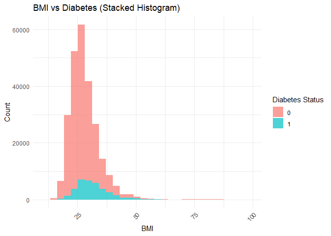
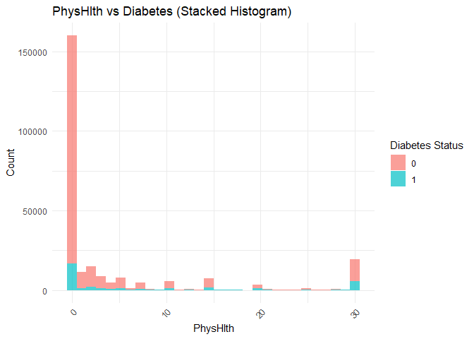

Final-Proj
================
Deo Shaji
2025-04-26

# Analysis of Diabetes Health Indicators

Deo Shaji

## Introduction

The goal of this project is to explore the Diabetes Health Indicators
Dataset to find out which variables or combination of variable are great
at modeling the chances a person has diabetes. As the number of people
with diabetes is growing significantly, it is important to understand
what variables are great indicators of diabetes.This understanding of
what indicators relate to diabetes can help with the learning what
causes diabetes or how to prevent diabetes in the future.

We will look at the following questions:

1.  Which variables are highly correlated to having diabetes?
2.  Can smoking status or alcohol consumption predict diabetes?
3.  Does diet affect chances of diabetes?
4.  Does Mental health, Physical Health, education, and income affect
    chances of diabetes?
5.  Can we predict a model that can accurately predict diabetes?

## Data

### Structure

The link to the dataset is
<https://www.kaggle.com/datasets/alexteboul/diabetes-health-indicators-dataset>.
This is a dataset from Kaggle containing data collected by survey from
400,000 Americans. This data was collected by the CDC as part of their
Behavioral Risk Factor Surveillance System(BRFSS). The dataset provided
by kaggle is a cleaned up version of the original survey for the year
2015. There are three csv files provided but we will only be looking at
the first csv file that contains 253,680 survey responses with a binary
categorization of 0 for no diabetes and 1 for pre diabetes or diabetes.
The other files will not be used in this analysis.

### Cleaning

This data set contains 253,680 responses with 22 variables in total. We
will go through the data set to remove any rows that have empty values,
then remove the variables deemed unnecessary.

``` r
library(tidyverse)
```

    ## Warning: package 'tidyverse' was built under R version 4.4.2

    ## Warning: package 'ggplot2' was built under R version 4.4.2

    ## Warning: package 'tibble' was built under R version 4.4.2

    ## Warning: package 'tidyr' was built under R version 4.4.2

    ## Warning: package 'readr' was built under R version 4.4.2

    ## Warning: package 'purrr' was built under R version 4.4.2

    ## Warning: package 'dplyr' was built under R version 4.4.2

    ## Warning: package 'stringr' was built under R version 4.4.2

    ## Warning: package 'forcats' was built under R version 4.4.2

    ## Warning: package 'lubridate' was built under R version 4.4.3

    ## ── Attaching core tidyverse packages ──────────────────────── tidyverse 2.0.0 ──
    ## ✔ dplyr     1.1.4     ✔ readr     2.1.5
    ## ✔ forcats   1.0.0     ✔ stringr   1.5.1
    ## ✔ ggplot2   3.5.1     ✔ tibble    3.2.1
    ## ✔ lubridate 1.9.4     ✔ tidyr     1.3.1
    ## ✔ purrr     1.0.4     
    ## ── Conflicts ────────────────────────────────────────── tidyverse_conflicts() ──
    ## ✖ dplyr::filter() masks stats::filter()
    ## ✖ dplyr::lag()    masks stats::lag()
    ## ℹ Use the conflicted package (<http://conflicted.r-lib.org/>) to force all conflicts to become errors

``` r
# load data set 
data <- read.csv("diabetes_binary_health_indicators_BRFSS2015.csv")
View(data)

# remove any records with empty values
data <- data %>%
  drop_na()

# check to see if any rows were deleted
nrow(data)
```

    ## [1] 253680

It seems that there were no empty cells in this data set. Now we will go
through all the variables and delete the ones deemed unnecessary.

``` r
colnames(data)
```

    ##  [1] "Diabetes_binary"      "HighBP"               "HighChol"            
    ##  [4] "CholCheck"            "BMI"                  "Smoker"              
    ##  [7] "Stroke"               "HeartDiseaseorAttack" "PhysActivity"        
    ## [10] "Fruits"               "Veggies"              "HvyAlcoholConsump"   
    ## [13] "AnyHealthcare"        "NoDocbcCost"          "GenHlth"             
    ## [16] "MentHlth"             "PhysHlth"             "DiffWalk"            
    ## [19] "Sex"                  "Age"                  "Education"           
    ## [22] "Income"

Cholcheck, AnyHealthcare, and NoDocbcCost are the three variables I plan
to remove. Cholcheck is a variable that returns 0 if the individual has
not checked their cholesterol in the past five years and returns 1 if
they have had a cholesterol check. Only 9,000 responded with 0 for this
variable implying the insignificance of Cholcheck. The same issue
occurred with the other two variables where only a small proportion of
people claimed they did not have any health insurance or that they did
not go see a doctor due to the costs.

``` r
# remove unnecessary columns
data <- data |>
  select(-CholCheck, -AnyHealthcare, -NoDocbcCost)

# check if columns were removed
ncol(data)
```

    ## [1] 19

### Variables

- Diabetes_binary: 0 for no diabetes, 1 for pre diabetic or diabetic

- HighBP: 0 = no high BP, 1 = high BP

- HighChol: 0 = no high cholesterol, 1 = high cholesterol

- BMI: Body Mass Index

- Smoker: Have you smoked at least 100 cigarettes in your entire life?
  \[Note: 5 packs = 100 cigarettes\] 0 = no 1 = yes

- Stroke: you had a stroke. 0 = no 1 = yes

- HeartDiseaseorAttack: coronary heart disease (CHD) or myocardial
  infarction (MI) 0 = no 1 = yes

- PhysActivity: physical activity in past 30 days - not including job 0
  = no 1 = yes

- Fruits: Consume Fruit 1 or more times per day 0 = no 1 = yes

- Veggies: Consume Vegetables 1 or more times per day 0 = no 1 = yes

- HvyAlcoholConsump: Heavy drinkers (adult men having more than 14
  drinks per week and adult women having more than 7 drinks per week) 0
  = no 1 = yes

- GenHlth: Would you say that in general your health is: scale 1-5 1 =
  excellent 2 = very good 3 = good 4 = fair 5 = poor

- MentHlth: Now thinking about your mental health, which includes
  stress, depression, and problems with emotions, for how many days
  during the past 30 days was your mental health not good? scale 1-30
  days

- PhysHlth: Now thinking about your physical health, which includes
  physical illness and injury, for how many days during the past 30 days
  was your physical health not good? scale 1-30 days

- DiffWalk: Do you have serious difficulty walking or climbing stairs? 0
  = no 1 = yes

- Sex: 0 = female 1 = male

- Age: 13-level age category. 1 = 18-24, 2 = 25 - 29, 3 = 30 - 34, 4 =
  35 - 39, 5 = 40 - 44, 6 = 45 - 49, 7 = 50 - 54, 8 = 55 - 59, 9 =
  60-64, 10 = 65 - 69, 11 = 70 - 74, 12 = 75 - 79, 13 = 80 or older

- Education: Education level scale 1-6: 1 = Never attended school or
  only kindergarten 2 = Grades 1 through 8 (Elementary) 3 = Grades 9
  through 11 (Some high school) 4 = Grade 12 or GED (High school
  graduate) 5 = College 1 year to 3 years (Some college or technical
  school) 6 = College 4 years or more (College graduate)

- Income: Income scale 1-8. 1 = less than 10,000, 2 = 10,000 - 15,000, 3
  = 15,000 - 20,000, 4 = 20,000 - 25,000, 5 = 25,000 - 35,000, 6 =
  35,000 - 50,000, 7 = 50,000 - 75,000, 8 = 75,000 or more

Majority of these variables are categorical, but have been classified as
num by R. I will update the variables to be represented as levels.

``` r
# update variables from num to levels
data <- data |>
  mutate(
    Diabetes_binary = factor(Diabetes_binary),
    HighBP = factor(HighBP),
    HighChol = factor(HighChol),
    Stroke = factor(Stroke),
    Smoker = factor(Smoker),
    HeartDiseaseorAttack = factor(HeartDiseaseorAttack),
    PhysActivity = factor(PhysActivity),
    Fruits = factor(Fruits),
    Veggies = factor(Veggies),
    HvyAlcoholConsump = factor(HvyAlcoholConsump),
    GenHlth = factor(GenHlth),
    MentHlth = as.numeric(MentHlth),
    PhysHlth = as.numeric(PhysHlth),
    DiffWalk = factor(DiffWalk),
    Sex = factor(Sex),
    Education = factor(Education),
    Income = factor(Income),
    Age = factor(Age)
  )

# check if the variables changed
str(data)
```

    ## 'data.frame':    253680 obs. of  19 variables:
    ##  $ Diabetes_binary     : Factor w/ 2 levels "0","1": 1 1 1 1 1 1 1 1 2 1 ...
    ##  $ HighBP              : Factor w/ 2 levels "0","1": 2 1 2 2 2 2 2 2 2 1 ...
    ##  $ HighChol            : Factor w/ 2 levels "0","1": 2 1 2 1 2 2 1 2 2 1 ...
    ##  $ BMI                 : num  40 25 28 27 24 25 30 25 30 24 ...
    ##  $ Smoker              : Factor w/ 2 levels "0","1": 2 2 1 1 1 2 2 2 2 1 ...
    ##  $ Stroke              : Factor w/ 2 levels "0","1": 1 1 1 1 1 1 1 1 1 1 ...
    ##  $ HeartDiseaseorAttack: Factor w/ 2 levels "0","1": 1 1 1 1 1 1 1 1 2 1 ...
    ##  $ PhysActivity        : Factor w/ 2 levels "0","1": 1 2 1 2 2 2 1 2 1 1 ...
    ##  $ Fruits              : Factor w/ 2 levels "0","1": 1 1 2 2 2 2 1 1 2 1 ...
    ##  $ Veggies             : Factor w/ 2 levels "0","1": 2 1 1 2 2 2 1 2 2 2 ...
    ##  $ HvyAlcoholConsump   : Factor w/ 2 levels "0","1": 1 1 1 1 1 1 1 1 1 1 ...
    ##  $ GenHlth             : Factor w/ 5 levels "1","2","3","4",..: 5 3 5 2 2 2 3 3 5 2 ...
    ##  $ MentHlth            : num  18 0 30 0 3 0 0 0 30 0 ...
    ##  $ PhysHlth            : num  15 0 30 0 0 2 14 0 30 0 ...
    ##  $ DiffWalk            : Factor w/ 2 levels "0","1": 2 1 2 1 1 1 1 2 2 1 ...
    ##  $ Sex                 : Factor w/ 2 levels "0","1": 1 1 1 1 1 2 1 1 1 2 ...
    ##  $ Age                 : Factor w/ 13 levels "1","2","3","4",..: 9 7 9 11 11 10 9 11 9 8 ...
    ##  $ Education           : Factor w/ 6 levels "1","2","3","4",..: 4 6 4 3 5 6 6 4 5 4 ...
    ##  $ Income              : Factor w/ 8 levels "1","2","3","4",..: 3 1 8 6 4 8 7 4 1 3 ...

## Results

### Which variables are highly correlated to having diabetes?

#### Categorical Variables

``` r
# List of categorical variables to plot
categorical_vars <- c("HighBP", "HighChol", "Smoker", "Stroke", "HeartDiseaseorAttack", "PhysActivity", "Fruits", "Veggies", "HvyAlcoholConsump", "GenHlth", "DiffWalk", "Sex", "Age", "Education", "Income")

for (var in categorical_vars) {
  print(
    data |>
      ggplot(aes_string(x = var, fill = "Diabetes_binary")) + 
      geom_bar(position = "dodge") + 
      labs(
        title = paste(var, "vs Diabetes"),
        x = var,
        y = "Count",
        fill = "Diabetes Status"
      ) +
      theme_minimal()
  )
}
```

    ## Warning: `aes_string()` was deprecated in ggplot2 3.0.0.
    ## ℹ Please use tidy evaluation idioms with `aes()`.
    ## ℹ See also `vignette("ggplot2-in-packages")` for more information.
    ## This warning is displayed once every 8 hours.
    ## Call `lifecycle::last_lifecycle_warnings()` to see where this warning was
    ## generated.

<!-- --><!-- --><!-- --><!-- --><!-- --><!-- --><!-- --><!-- --><!-- --><!-- --><!-- --><!-- --><!-- --><!-- --><!-- -->

What we want to look at is which variables have a high correlation with
having diabetes.

Here are the list of categorical variables that correlate with having
diabetes

- HighBP

- HighChol

- PhysActivity

- Fruits

- Veggies

- HvyAlcoholConsump

- GenHlth

- Age

- HeartDiseaseorAttack

- Stroke

While all the variables listed above show some correlation with having
diabetes, it does not imply that these variables directly affect the
chances of a person having diabetes. For the variable stroke, there are
significantly more people who have not had a stroke that have diabetes
compared to the number of people who have had a stroke and have
diabetes. This does not imply that not having a stroke increases your
chances of having diabetes. The only reason this occurred is that the
number of people who had strokes was very few to begin with. This is the
same case with HeartDiseaseorAttack. The number of people who have not
had a heart attack and have diabetes is higher than the number of people
with diabetes and heart disease. This situation is the result of having
very few people with heart disease in the survey to begin with. This is
the same scenario with PhysActivity, Fruits, Veggies, and
HvyAlcoholConsump. The variables that showed minimal or no relationship
with having diabetes are Smoker, DiffWalk, Sex, Education, and Income.

#### Numerical Variables

``` r
# List of numerical variables to plot
numerical_vars <- c("BMI", "MentHlth", "PhysHlth")

for (var in numerical_vars) {
  print(
    data |>
      ggplot(aes_string(x = var, fill = "Diabetes_binary")) + 
      geom_histogram(position = "stack", bins = 30, alpha = 0.7) +  # Stacked histogram
      labs(
        title = paste(var, "vs Diabetes (Stacked Histogram)"),
        x = var,
        y = "Count",
        fill = "Diabetes Status"
      ) +
      theme_minimal() +
      theme(axis.text.x = element_text(angle = 45, hjust = 1))  # Rotate x-axis text for readability
  )
}
```

<!-- --><!-- --><!-- -->

While it might seem like people with one day of bad physical health or
mental health have a higher chance of having diabetes from this
histogram, it is not true. The higher number of people with diabetes is
due to the large number of people who only had one bad day of mental or
physical health. With BMI, it seems that people with a BMI of 25-30 have
a higher chance of having diabetes compared to other BMI values,
however, this is only due to majority of the population having those BMI
values as well. It seems that there is a slight correlation between BMI
and diabetes, but further analysis would be needed to make sure.

### Can smoking status or alcohol consumption predict diabetes?

#### Smoking Status

``` r
# Fit a logistic regression model for SmokingStatus as a predictor of Diabetes
model_smoking <- glm(Diabetes_binary ~ Smoker, data = data, family = "binomial")

# Summary of the model
summary(model_smoking)
```

    ## 
    ## Call:
    ## glm(formula = Diabetes_binary ~ Smoker, family = "binomial", 
    ##     data = data)
    ## 
    ## Coefficients:
    ##              Estimate Std. Error z value Pr(>|z|)    
    ## (Intercept) -1.987201   0.008171 -243.19   <2e-16 ***
    ## Smoker1      0.350609   0.011489   30.52   <2e-16 ***
    ## ---
    ## Signif. codes:  0 '***' 0.001 '**' 0.01 '*' 0.05 '.' 0.1 ' ' 1
    ## 
    ## (Dispersion parameter for binomial family taken to be 1)
    ## 
    ##     Null deviance: 204847  on 253679  degrees of freedom
    ## Residual deviance: 203916  on 253678  degrees of freedom
    ## AIC: 203920
    ## 
    ## Number of Fisher Scoring iterations: 4

Here the p-value for smoker is \<0.05 implying that the smoker variable
is statistically significant. Smoker 1 has an estimate of 0.350609 which
results in a positive relationship between smoking and having diabetes
with a log odds of .35 or odds ratio of 1.41993202. What this means is
that the chances of having diabetes as a smoker is 1.4199 times higher
than a person who does not smoke.

#### Heavy Alcohol Consumption

``` r
# Fit a logistic regression model for Alcohol Consumption as a predictor of Diabetes
model_alcohol <- glm(Diabetes_binary ~ HvyAlcoholConsump, data = data, family = "binomial")

# Summary of the model
summary(model_alcohol)
```

    ## 
    ## Call:
    ## glm(formula = Diabetes_binary ~ HvyAlcoholConsump, family = "binomial", 
    ##     data = data)
    ## 
    ## Coefficients:
    ##                     Estimate Std. Error z value Pr(>|z|)    
    ## (Intercept)        -1.781206   0.005818 -306.13   <2e-16 ***
    ## HvyAlcoholConsump1 -0.999761   0.036197  -27.62   <2e-16 ***
    ## ---
    ## Signif. codes:  0 '***' 0.001 '**' 0.01 '*' 0.05 '.' 0.1 ' ' 1
    ## 
    ## (Dispersion parameter for binomial family taken to be 1)
    ## 
    ##     Null deviance: 204847  on 253679  degrees of freedom
    ## Residual deviance: 203835  on 253678  degrees of freedom
    ## AIC: 203839
    ## 
    ## Number of Fisher Scoring iterations: 5

Here the p-value for alcohol consumption is \<0.05 implying that the
HvyAlcoholConsump variable is statistically significant.
HvyAlcoholConsump1 has an estimate of -.999761 which results in a
negative relationship between heavy alcohol consumption and having
diabetes with a log odds of -.999 or odds ratio of .36796737. What this
means is that the people who consume large amounts of alcohol have a 63%
lower chance of having diabetes compared to those who do not consume
large amounts. Even though this seems to be statistically significant
due to the low p value, it does not mean that heavy alcohol use directly
decreases chances of having diabetes. This unusual correlation can be
explained by the data imbalance where a large number of the population
are not heavy users. One way to deal with this imbalance in the data is
to move to a random forest model that is much better at dealing with
data imbalances.

#### Smoker Status and Heavy Alcohol Consumption

``` r
# Fit a multiple logistic regression model with Smoker and HvyAlcoholConsump
model_both <- glm(Diabetes_binary ~ Smoker + HvyAlcoholConsump, data = data, family = "binomial")

# Summary of the model
summary(model_both)
```

    ## 
    ## Call:
    ## glm(formula = Diabetes_binary ~ Smoker + HvyAlcoholConsump, family = "binomial", 
    ##     data = data)
    ## 
    ## Coefficients:
    ##                     Estimate Std. Error z value Pr(>|z|)    
    ## (Intercept)        -1.961472   0.008196 -239.31   <2e-16 ***
    ## Smoker1             0.387792   0.011542   33.60   <2e-16 ***
    ## HvyAlcoholConsump1 -1.086191   0.036322  -29.91   <2e-16 ***
    ## ---
    ## Signif. codes:  0 '***' 0.001 '**' 0.01 '*' 0.05 '.' 0.1 ' ' 1
    ## 
    ## (Dispersion parameter for binomial family taken to be 1)
    ## 
    ##     Null deviance: 204847  on 253679  degrees of freedom
    ## Residual deviance: 202706  on 253677  degrees of freedom
    ## AIC: 202712
    ## 
    ## Number of Fisher Scoring iterations: 5

``` r
# Predict probabilities
predicted_probs <- predict(model_both, type = "response")

# Convert to 0/1 based on 0.5 threshold
predicted_classes <- ifelse(predicted_probs > 0.5, 1, 0)

# Confusion matrix
conf_matrix <- table(Predicted = predicted_classes, Actual = data$Diabetes_binary)
print(conf_matrix)
```

    ##          Actual
    ## Predicted      0      1
    ##         0 218334  35346

``` r
# Accuracy
accuracy <- mean(predicted_classes == data$Diabetes_binary)

print(accuracy)
```

    ## [1] 0.860667

I ran a logistic model with both Smoker and HvyAlcoholConsump. Since it
has 2 variables, each variable has different log odds values. To find
the accuracy of this model, I predicted the probability based on the
logistic model. Then based on the probability being greater than .5, I
classify the values as 0 or 1. Then I run a confusion matrix where it
looks at how many times the model predicted accurately. Finally, I look
at the ratio of correct predictions to the number of total predictions
to give me an accuracy score. This logistic model is accurate around
86.07% of the time.

### Does diet affect chances of diabetes?

``` r
# Fit a logistic regression model
model_diet <- glm(Diabetes_binary ~ Fruits + Veggies, data = data, family = "binomial")

# Look at the model summary
summary(model_diet)
```

    ## 
    ## Call:
    ## glm(formula = Diabetes_binary ~ Fruits + Veggies, family = "binomial", 
    ##     data = data)
    ## 
    ## Coefficients:
    ##             Estimate Std. Error z value Pr(>|z|)    
    ## (Intercept) -1.45523    0.01266 -114.91   <2e-16 ***
    ## Fruits1     -0.16665    0.01214  -13.72   <2e-16 ***
    ## Veggies1    -0.33340    0.01411  -23.63   <2e-16 ***
    ## ---
    ## Signif. codes:  0 '***' 0.001 '**' 0.01 '*' 0.05 '.' 0.1 ' ' 1
    ## 
    ## (Dispersion parameter for binomial family taken to be 1)
    ## 
    ##     Null deviance: 204847  on 253679  degrees of freedom
    ## Residual deviance: 203892  on 253677  degrees of freedom
    ## AIC: 203898
    ## 
    ## Number of Fisher Scoring iterations: 4

``` r
# Predict probabilities
predicted_probs_diet <- predict(model_diet, type = "response")

# Classify as diabetic (1) if probability > 0.5
predicted_classes_diet <- ifelse(predicted_probs > 0.5, 1, 0)

# Confusion matrix
conf_matrix <- table(Predicted = predicted_classes_diet, Actual = data$Diabetes_binary)
print(conf_matrix)
```

    ##          Actual
    ## Predicted      0      1
    ##         0 218334  35346

``` r
# Calculate accuracy
accuracy_diet <- mean(predicted_classes == data$Diabetes_binary)

accuracy_diet
```

    ## [1] 0.860667

Since the P values for both the fruits and veggies is less than 0.05,
both variables are statistically significant. Both have negative log
odds which imply that eating fruits or vegetables at least once a day is
associated with decreased chances of having diabetes with veggies being
slightly more impactfull. Interestingly enough, this model and the
previous model both have the same accuracy score of 86.066% this can be
explained by multiple reasons. First, the data is heavily imbalanced.
since majority of the people do not have diabetes, a model guessing no
diabetes most of the time results in a high accuracy. Another reason is
that both models only have 2 variables. The limited number of variables
results in two models that have same accuracy scores.

### Does Mental health, Physical Health, education, and income affect chances of diabetes?

``` r
model_sociohealth <- glm(
  Diabetes_binary ~ MentHlth + PhysHlth + Education + Income + DiffWalk,
  data = data,
  family = "binomial"
)

# View model results
summary(model_sociohealth)
```

    ## 
    ## Call:
    ## glm(formula = Diabetes_binary ~ MentHlth + PhysHlth + Education + 
    ##     Income + DiffWalk, family = "binomial", data = data)
    ## 
    ## Coefficients:
    ##               Estimate Std. Error z value Pr(>|z|)    
    ## (Intercept) -1.4591695  0.1790134  -8.151 3.60e-16 ***
    ## MentHlth    -0.0046725  0.0007700  -6.068 1.29e-09 ***
    ## PhysHlth     0.0189336  0.0006678  28.352  < 2e-16 ***
    ## Education2   0.0482908  0.1812122   0.266 0.789864    
    ## Education3  -0.1856702  0.1793543  -1.035 0.300569    
    ## Education4  -0.3160082  0.1780128  -1.775 0.075865 .  
    ## Education5  -0.4018036  0.1780642  -2.257 0.024039 *  
    ## Education6  -0.5905437  0.1781785  -3.314 0.000919 ***
    ## Income2      0.1258198  0.0327001   3.848 0.000119 ***
    ## Income3      0.0495283  0.0314871   1.573 0.115725    
    ## Income4      0.0227210  0.0307791   0.738 0.460397    
    ## Income5     -0.0511487  0.0303247  -1.687 0.091661 .  
    ## Income6     -0.1599795  0.0298115  -5.366 8.03e-08 ***
    ## Income7     -0.2606116  0.0300745  -8.666  < 2e-16 ***
    ## Income8     -0.6049497  0.0296503 -20.403  < 2e-16 ***
    ## DiffWalk1    0.8882068  0.0152131  58.384  < 2e-16 ***
    ## ---
    ## Signif. codes:  0 '***' 0.001 '**' 0.01 '*' 0.05 '.' 0.1 ' ' 1
    ## 
    ## (Dispersion parameter for binomial family taken to be 1)
    ## 
    ##     Null deviance: 204847  on 253679  degrees of freedom
    ## Residual deviance: 190575  on 253664  degrees of freedom
    ## AIC: 190607
    ## 
    ## Number of Fisher Scoring iterations: 5

This model is interesting due to the fact that some of the variables are
not statistically significant. Education 2 - 4 and Income 3 - 5 have p
values higher than 0.05 implying they are not statistically significant.
What this implies is that middle income ranges and middle education
ranges are not good predictors for if a person has diabetes or not.
Larger number of bad mental health days result in a lower chance of
diabetes. However, the log odds is extremely low to the point of
neglecting the effect mental health has on Diabetes. Physical Health
seem to be a decent indicator of diabetes as higher number of days with
bad physical health increases the chance of having diabetes. The
unexpected variable in this case is the DiffWalk1. Having difficulty
walking up stairs has a log odds of .888 resulting in a odds ratio of
2.43. People who have difficulty walking up the stairs have a 2.43 times
odds of having diabetes compared to people who do not have difficulty
walking up the stairs. Since DiffWalk seems to be a great predictor for
diabetes, we should look at how it acts alone in a model

#### DiffWalk1 Model

``` r
# Fit a logistic regression with only DiffWalk
model_diffwalk_only <- glm(
  Diabetes_binary ~ DiffWalk,
  data = data,
  family = "binomial"
)

# View the summary
summary(model_diffwalk_only)
```

    ## 
    ## Call:
    ## glm(formula = Diabetes_binary ~ DiffWalk, family = "binomial", 
    ##     data = data)
    ## 
    ## Coefficients:
    ##              Estimate Std. Error z value Pr(>|z|)    
    ## (Intercept) -2.139365   0.007091  -301.7   <2e-16 ***
    ## DiffWalk1    1.327359   0.012662   104.8   <2e-16 ***
    ## ---
    ## Signif. codes:  0 '***' 0.001 '**' 0.01 '*' 0.05 '.' 0.1 ' ' 1
    ## 
    ## (Dispersion parameter for binomial family taken to be 1)
    ## 
    ##     Null deviance: 204847  on 253679  degrees of freedom
    ## Residual deviance: 194730  on 253678  degrees of freedom
    ## AIC: 194734
    ## 
    ## Number of Fisher Scoring iterations: 4

When running a model with just the DiffWalk variable, the odds increase
with a log odds of 1.327 and a odds ratio of 3.771. This implies that
people who have difficulty walking up stairs have a 3.771 times higher
odds of having diabetes compared to a person who does not have
difficulty walking up stairs. While DiffWalk might be a great predictor
of diabetes, it is important to note that being an only variable has its
cons with reduced accuracy.

### Can we predict a model that can accurately predict diabetes?

In this section, we will look at logistic regression, random forest, and
KNN

#### Logistic Regression

``` r
model_full <- glm(Diabetes_binary ~ ., data = data, family = "binomial")
summary(model_full)
```

    ## 
    ## Call:
    ## glm(formula = Diabetes_binary ~ ., family = "binomial", data = data)
    ## 
    ## Coefficients:
    ##                         Estimate Std. Error z value Pr(>|z|)    
    ## (Intercept)           -6.7996722  0.2291886 -29.668  < 2e-16 ***
    ## HighBP1                0.7329293  0.0147383  49.730  < 2e-16 ***
    ## HighChol1              0.5463580  0.0136164  40.125  < 2e-16 ***
    ## BMI                    0.0578762  0.0009113  63.509  < 2e-16 ***
    ## Smoker1               -0.0443765  0.0132944  -3.338 0.000844 ***
    ## Stroke1                0.1638494  0.0249721   6.561 5.33e-11 ***
    ## HeartDiseaseorAttack1  0.2588877  0.0177576  14.579  < 2e-16 ***
    ## PhysActivity1         -0.0533524  0.0144002  -3.705 0.000211 ***
    ## Fruits1               -0.0195388  0.0137113  -1.425 0.154153    
    ## Veggies1              -0.0294619  0.0159026  -1.853 0.063934 .  
    ## HvyAlcoholConsump1    -0.7841221  0.0385227 -20.355  < 2e-16 ***
    ## GenHlth2               0.7300958  0.0335108  21.787  < 2e-16 ***
    ## GenHlth3               1.4283584  0.0327516  43.612  < 2e-16 ***
    ## GenHlth4               1.8579541  0.0354323  52.437  < 2e-16 ***
    ## GenHlth5               2.0341279  0.0423222  48.063  < 2e-16 ***
    ## MentHlth              -0.0029788  0.0008463  -3.520 0.000432 ***
    ## PhysHlth              -0.0032978  0.0008041  -4.101 4.11e-05 ***
    ## DiffWalk1              0.1495880  0.0169034   8.850  < 2e-16 ***
    ## Sex1                   0.2600236  0.0134771  19.294  < 2e-16 ***
    ## Age2                   0.1318333  0.1457599   0.904 0.365754    
    ## Age3                   0.4422320  0.1306483   3.385 0.000712 ***
    ## Age4                   0.8657252  0.1240381   6.980 2.96e-12 ***
    ## Age5                   1.1178096  0.1213294   9.213  < 2e-16 ***
    ## Age6                   1.3173770  0.1196193  11.013  < 2e-16 ***
    ## Age7                   1.5452151  0.1184317  13.047  < 2e-16 ***
    ## Age8                   1.6333410  0.1180499  13.836  < 2e-16 ***
    ## Age9                   1.8502185  0.1178153  15.704  < 2e-16 ***
    ## Age10                  2.0256615  0.1178100  17.194  < 2e-16 ***
    ## Age11                  2.0744637  0.1181900  17.552  < 2e-16 ***
    ## Age12                  1.9871892  0.1188520  16.720  < 2e-16 ***
    ## Age13                  1.8020326  0.1190150  15.141  < 2e-16 ***
    ## Education2            -0.0217433  0.1950742  -0.111 0.911250    
    ## Education3            -0.1395921  0.1931516  -0.723 0.469860    
    ## Education4            -0.1976638  0.1917329  -1.031 0.302572    
    ## Education5            -0.1576852  0.1918111  -0.822 0.411028    
    ## Education6            -0.2471618  0.1919281  -1.288 0.197821    
    ## Income2               -0.0114948  0.0354260  -0.324 0.745579    
    ## Income3               -0.0401943  0.0341978  -1.175 0.239856    
    ## Income4               -0.0597644  0.0335424  -1.782 0.074789 .  
    ## Income5               -0.1391452  0.0331221  -4.201 2.66e-05 ***
    ## Income6               -0.2187453  0.0326168  -6.707 1.99e-11 ***
    ## Income7               -0.2345785  0.0329304  -7.123 1.05e-12 ***
    ## Income8               -0.3672866  0.0325727 -11.276  < 2e-16 ***
    ## ---
    ## Signif. codes:  0 '***' 0.001 '**' 0.01 '*' 0.05 '.' 0.1 ' ' 1
    ## 
    ## (Dispersion parameter for binomial family taken to be 1)
    ## 
    ##     Null deviance: 204847  on 253679  degrees of freedom
    ## Residual deviance: 161273  on 253637  degrees of freedom
    ## AIC: 161359
    ## 
    ## Number of Fisher Scoring iterations: 6

From this logistic model, I will remove all the variables with high p
values(\> 0.05). I plan to remove Fruits, Veggies, Education, and
Income. Even though Age2 had a High p value, I believe it to be
unnecessary to remove the entire variable due to that one large p value.
I am further convinced to contain the age variable after looking at the
large log odds provided by some of the age ranges.

``` r
model_refined <- glm(Diabetes_binary ~ HighBP + HighChol + BMI + Smoker + Stroke + HeartDiseaseorAttack + PhysActivity + HvyAlcoholConsump + GenHlth + MentHlth + PhysHlth + DiffWalk + Sex + Age, data = data, family = "binomial")

summary(model_refined)
```

    ## 
    ## Call:
    ## glm(formula = Diabetes_binary ~ HighBP + HighChol + BMI + Smoker + 
    ##     Stroke + HeartDiseaseorAttack + PhysActivity + HvyAlcoholConsump + 
    ##     GenHlth + MentHlth + PhysHlth + DiffWalk + Sex + Age, family = "binomial", 
    ##     data = data)
    ## 
    ## Coefficients:
    ##                         Estimate Std. Error z value Pr(>|z|)    
    ## (Intercept)           -7.2040642  0.1242522 -57.979  < 2e-16 ***
    ## HighBP1                0.7469682  0.0147078  50.787  < 2e-16 ***
    ## HighChol1              0.5415433  0.0135908  39.846  < 2e-16 ***
    ## BMI                    0.0579386  0.0009096  63.694  < 2e-16 ***
    ## Smoker1               -0.0195296  0.0131432  -1.486  0.13730    
    ## Stroke1                0.1841500  0.0249368   7.385 1.53e-13 ***
    ## HeartDiseaseorAttack1  0.2633762  0.0177487  14.839  < 2e-16 ***
    ## PhysActivity1         -0.0811883  0.0141825  -5.725 1.04e-08 ***
    ## HvyAlcoholConsump1    -0.8146387  0.0384404 -21.192  < 2e-16 ***
    ## GenHlth2               0.7440952  0.0334553  22.241  < 2e-16 ***
    ## GenHlth3               1.4821470  0.0325997  45.465  < 2e-16 ***
    ## GenHlth4               1.9605733  0.0350984  55.859  < 2e-16 ***
    ## GenHlth5               2.1593071  0.0419043  51.529  < 2e-16 ***
    ## MentHlth              -0.0014706  0.0008406  -1.750  0.08019 .  
    ## PhysHlth              -0.0035290  0.0008033  -4.393 1.12e-05 ***
    ## DiffWalk1              0.1899120  0.0167732  11.322  < 2e-16 ***
    ## Sex1                   0.2164288  0.0131545  16.453  < 2e-16 ***
    ## Age2                   0.0933878  0.1456978   0.641  0.52154    
    ## Age3                   0.3782272  0.1305627   2.897  0.00377 ** 
    ## Age4                   0.7853602  0.1239243   6.337 2.34e-10 ***
    ## Age5                   1.0272483  0.1212043   8.475  < 2e-16 ***
    ## Age6                   1.2273072  0.1194976  10.271  < 2e-16 ***
    ## Age7                   1.4597811  0.1183262  12.337  < 2e-16 ***
    ## Age8                   1.5457655  0.1179469  13.106  < 2e-16 ***
    ## Age9                   1.7652617  0.1177148  14.996  < 2e-16 ***
    ## Age10                  1.9471833  0.1177054  16.543  < 2e-16 ***
    ## Age11                  2.0094283  0.1180906  17.016  < 2e-16 ***
    ## Age12                  1.9359315  0.1187568  16.302  < 2e-16 ***
    ## Age13                  1.7562172  0.1188979  14.771  < 2e-16 ***
    ## ---
    ## Signif. codes:  0 '***' 0.001 '**' 0.01 '*' 0.05 '.' 0.1 ' ' 1
    ## 
    ## (Dispersion parameter for binomial family taken to be 1)
    ## 
    ##     Null deviance: 204847  on 253679  degrees of freedom
    ## Residual deviance: 161744  on 253651  degrees of freedom
    ## AIC: 161802
    ## 
    ## Number of Fisher Scoring iterations: 6

Due to smoker and MentHlth having large p values, I plan on removing
them from the regression

``` r
set.seed(123)  # for reproducibility
sample_index <- sample(seq_len(nrow(data)), size = 0.7 * nrow(data))  # 70% train

train_data <- data[sample_index, ]
test_data  <- data[-sample_index, ]
model_refined_1 <- glm(Diabetes_binary ~ HighBP + HighChol + BMI + Stroke + HeartDiseaseorAttack + PhysActivity + HvyAlcoholConsump + GenHlth + PhysHlth + DiffWalk + Sex + Age, data = train_data, family = "binomial")

summary(model_refined_1)
```

    ## 
    ## Call:
    ## glm(formula = Diabetes_binary ~ HighBP + HighChol + BMI + Stroke + 
    ##     HeartDiseaseorAttack + PhysActivity + HvyAlcoholConsump + 
    ##     GenHlth + PhysHlth + DiffWalk + Sex + Age, family = "binomial", 
    ##     data = train_data)
    ## 
    ## Coefficients:
    ##                         Estimate Std. Error z value Pr(>|z|)    
    ## (Intercept)           -7.4265513  0.1631306 -45.525  < 2e-16 ***
    ## HighBP1                0.7425271  0.0175831  42.230  < 2e-16 ***
    ## HighChol1              0.5421607  0.0162406  33.383  < 2e-16 ***
    ## BMI                    0.0578336  0.0010819  53.458  < 2e-16 ***
    ## Stroke1                0.1826279  0.0296457   6.160 7.26e-10 ***
    ## HeartDiseaseorAttack1  0.2550893  0.0211743  12.047  < 2e-16 ***
    ## PhysActivity1         -0.0746687  0.0169461  -4.406 1.05e-05 ***
    ## HvyAlcoholConsump1    -0.8163123  0.0458729 -17.795  < 2e-16 ***
    ## GenHlth2               0.7540412  0.0402302  18.743  < 2e-16 ***
    ## GenHlth3               1.4973732  0.0391899  38.208  < 2e-16 ***
    ## GenHlth4               1.9577205  0.0420872  46.516  < 2e-16 ***
    ## GenHlth5               2.1493648  0.0499316  43.046  < 2e-16 ***
    ## PhysHlth              -0.0025455  0.0009393  -2.710 0.006731 ** 
    ## DiffWalk1              0.1815581  0.0199777   9.088  < 2e-16 ***
    ## Sex1                   0.2007369  0.0155528  12.907  < 2e-16 ***
    ## Age2                   0.2756354  0.1867907   1.476 0.140041    
    ## Age3                   0.5680800  0.1701624   3.338 0.000842 ***
    ## Age4                   0.9914838  0.1626423   6.096 1.09e-09 ***
    ## Age5                   1.2376901  0.1597200   7.749 9.25e-15 ***
    ## Age6                   1.4314123  0.1579433   9.063  < 2e-16 ***
    ## Age7                   1.6609320  0.1566555  10.602  < 2e-16 ***
    ## Age8                   1.7536528  0.1562497  11.223  < 2e-16 ***
    ## Age9                   1.9589452  0.1559785  12.559  < 2e-16 ***
    ## Age10                  2.1520834  0.1559377  13.801  < 2e-16 ***
    ## Age11                  2.2347009  0.1563099  14.297  < 2e-16 ***
    ## Age12                  2.1411894  0.1570436  13.634  < 2e-16 ***
    ## Age13                  1.9375317  0.1572314  12.323  < 2e-16 ***
    ## ---
    ## Signif. codes:  0 '***' 0.001 '**' 0.01 '*' 0.05 '.' 0.1 ' ' 1
    ## 
    ## (Dispersion parameter for binomial family taken to be 1)
    ## 
    ##     Null deviance: 143206  on 177575  degrees of freedom
    ## Residual deviance: 113018  on 177549  degrees of freedom
    ## AIC: 113072
    ## 
    ## Number of Fisher Scoring iterations: 7

Since I believe Physical Activity and BMI are related, I plan on running
an interaction model between those variables.

``` r
model_refined_2 <- glm(Diabetes_binary ~ HighBP + HighChol + BMI*PhysActivity + Stroke + HeartDiseaseorAttack + HvyAlcoholConsump + GenHlth + PhysHlth + DiffWalk + Sex + Age, data = train_data, family = "binomial")

summary(model_refined_2)
```

    ## 
    ## Call:
    ## glm(formula = Diabetes_binary ~ HighBP + HighChol + BMI * PhysActivity + 
    ##     Stroke + HeartDiseaseorAttack + HvyAlcoholConsump + GenHlth + 
    ##     PhysHlth + DiffWalk + Sex + Age, family = "binomial", data = train_data)
    ## 
    ## Coefficients:
    ##                         Estimate Std. Error z value Pr(>|z|)    
    ## (Intercept)           -7.2944641  0.1683659 -43.325  < 2e-16 ***
    ## HighBP1                0.7419511  0.0175828  42.197  < 2e-16 ***
    ## HighChol1              0.5419862  0.0162385  33.377  < 2e-16 ***
    ## BMI                    0.0537336  0.0016810  31.966  < 2e-16 ***
    ## PhysActivity1         -0.2828275  0.0677539  -4.174 2.99e-05 ***
    ## Stroke1                0.1814122  0.0296408   6.120 9.34e-10 ***
    ## HeartDiseaseorAttack1  0.2547290  0.0211703  12.032  < 2e-16 ***
    ## HvyAlcoholConsump1    -0.8163664  0.0458658 -17.799  < 2e-16 ***
    ## GenHlth2               0.7511768  0.0402546  18.661  < 2e-16 ***
    ## GenHlth3               1.4928094  0.0392265  38.056  < 2e-16 ***
    ## GenHlth4               1.9529840  0.0421199  46.367  < 2e-16 ***
    ## GenHlth5               2.1442714  0.0499488  42.929  < 2e-16 ***
    ## PhysHlth              -0.0025235  0.0009388  -2.688  0.00719 ** 
    ## DiffWalk1              0.1819074  0.0199697   9.109  < 2e-16 ***
    ## Sex1                   0.2000036  0.0155535  12.859  < 2e-16 ***
    ## Age2                   0.2774557  0.1868243   1.485  0.13751    
    ## Age3                   0.5658035  0.1702669   3.323  0.00089 ***
    ## Age4                   0.9922292  0.1627266   6.098 1.08e-09 ***
    ## Age5                   1.2397598  0.1598029   7.758 8.62e-15 ***
    ## Age6                   1.4342824  0.1580290   9.076  < 2e-16 ***
    ## Age7                   1.6641694  0.1567445  10.617  < 2e-16 ***
    ## Age8                   1.7571668  0.1563411  11.239  < 2e-16 ***
    ## Age9                   1.9625431  0.1560714  12.575  < 2e-16 ***
    ## Age10                  2.1560598  0.1560325  13.818  < 2e-16 ***
    ## Age11                  2.2384826  0.1564052  14.312  < 2e-16 ***
    ## Age12                  2.1446841  0.1571392  13.648  < 2e-16 ***
    ## Age13                  1.9401573  0.1573275  12.332  < 2e-16 ***
    ## BMI:PhysActivity1      0.0066746  0.0021047   3.171  0.00152 ** 
    ## ---
    ## Signif. codes:  0 '***' 0.001 '**' 0.01 '*' 0.05 '.' 0.1 ' ' 1
    ## 
    ## (Dispersion parameter for binomial family taken to be 1)
    ## 
    ##     Null deviance: 143206  on 177575  degrees of freedom
    ## Residual deviance: 113008  on 177548  degrees of freedom
    ## AIC: 113064
    ## 
    ## Number of Fisher Scoring iterations: 7

Now I plan on testing the accuracy of the original logistic model and
interaction model.

``` r
# Original
# Step 1: Generate predicted probabilities
predicted_probs_1 <- predict(model_refined_1, newdata = test_data, type = "response")

# Step 2: Convert probabilities to binary predictions (threshold at 0.5)
predicted_classes_1 <- ifelse(predicted_probs_1 >= 0.5, 1, 0)

# Step 3: Compare predictions to actual values and calculate accuracy
accuracy_1 <- mean(predicted_classes_1 == data$Diabetes_binary)
```

    ## Warning in `==.default`(predicted_classes_1, data$Diabetes_binary): longer
    ## object length is not a multiple of shorter object length

    ## Warning in is.na(e1) | is.na(e2): longer object length is not a multiple of
    ## shorter object length

``` r
accuracy_1
```

    ## [1] 0.8340705

``` r
# Interaction
# Step 1: Generate predicted probabilities
predicted_probs_2 <- predict(model_refined_2, newdata = test_data, type = "response")

# Step 2: Convert probabilities to binary predictions (threshold at 0.5)
predicted_classes_2 <- ifelse(predicted_probs_2 >= 0.5, 1, 0)

# Step 3: Compare predictions to actual values and calculate accuracy
accuracy_2 <- mean(predicted_classes_2 == data$Diabetes_binary)
```

    ## Warning in `==.default`(predicted_classes_2, data$Diabetes_binary): longer
    ## object length is not a multiple of shorter object length
    ## Warning in `==.default`(predicted_classes_2, data$Diabetes_binary): longer
    ## object length is not a multiple of shorter object length

``` r
accuracy_2
```

    ## [1] 0.8343109

The original model has an accuracy score of 0.8340705 and the
interaction model has an accuracy score of 0.8343109. While both models
have similar accuracy, the logistic model with an interaction is more
accurate. One thing to note here is that logistic is not a good model to
use for this type of data. Due to the large number of variables, there
is the possibility of multicollinearity which can increase the p values
for some variables and result in excluding those variables from the
final model.

#### Random Forest

``` r
library(randomForest)
```

    ## Warning: package 'randomForest' was built under R version 4.4.3

    ## randomForest 4.7-1.2

    ## Type rfNews() to see new features/changes/bug fixes.

    ## 
    ## Attaching package: 'randomForest'

    ## The following object is masked from 'package:dplyr':
    ## 
    ##     combine

    ## The following object is masked from 'package:ggplot2':
    ## 
    ##     margin

``` r
library(class)
```

    ## Warning: package 'class' was built under R version 4.4.3

``` r
library(caret)
```

    ## Warning: package 'caret' was built under R version 4.4.3

    ## Loading required package: lattice

    ## 
    ## Attaching package: 'caret'

    ## The following object is masked from 'package:purrr':
    ## 
    ##     lift

``` r
set.seed(123)  # for reproducibility
k <- 5
folds <- createFolds(data$Diabetes_binary, k = k)

accuracies <- c()

for(i in 1:k) {
  # Split data into training and testing
  test_indices <- folds[[i]]
  test_data <- data[test_indices, ]
  train_data <- data[-test_indices, ]
  
  # Train the model
  rf_model <- randomForest(Diabetes_binary ~ HighBP + HighChol + BMI + Stroke + 
                           HeartDiseaseorAttack + PhysActivity + HvyAlcoholConsump + GenHlth +  PhysHlth + DiffWalk + Sex + Age, 
                           data = train_data, ntree = 500)
  
  # Predict on the test set
  pred_rf <- predict(rf_model, newdata = test_data)
  
  # Calculate accuracy
  fold_accuracy <- mean(pred_rf == test_data$Diabetes_binary)
  accuracies <- c(accuracies, fold_accuracy)
}

# Average cross-validated accuracy
cv_accuracy <- mean(accuracies)
cv_accuracy
```

    ## [1] 0.8659413

A Random Forest is a model in which multiple decision trees are trained
on subsets of the data. The decision trees grow based on MSE until it
reaches 500. Then, the forest votes from all the created trees to create
the random forest. So far, this model has given us the highest accuracy
with 86.59% accuracy in predicting if a person is diabetic or not.
However, there are downsides to such models. Creating a random forest is
highly computational and can take a lot of time to create. This current
model took around 12 minutes to render out to get an accuracy score.

#### KNN

``` r
# Split the data into training and test sets
set.seed(42)
trainIndex <- createDataPartition(data$Diabetes_binary, p = 0.75, list = FALSE)
train_data <- data[trainIndex, ]
test_data <- data[-trainIndex, ]

# Scale the features (except the target variable)
pre_process <- preProcess(train_data[, -1], method = "scale")
train_scaled <- predict(pre_process, train_data[, -1])
test_scaled <- predict(pre_process, test_data[, -1])

# Add back the target variable (Diabetes_binary)
train_scaled$Diabetes_binary <- train_data$Diabetes_binary
test_scaled$Diabetes_binary <- test_data$Diabetes_binary

# Train the KNN model with k = 5 (you can try different values of k)
k_value <- 15
knn_model <- knn(train = train_scaled[, -ncol(train_scaled)], 
                 test = test_scaled[, -ncol(test_scaled)], 
                 cl = train_scaled$Diabetes_binary, 
                 k = k_value)
# Compare predictions to actual values and calculate accuracy
accuracy_knn <- mean(knn_model == test_scaled$Diabetes_binary)
accuracy_knn
```

    ## [1] 0.8627225

To run a KNN model, I first partitioned the data into two sets. A
training set and testing set. The KNN model would be trained on the
train_data set and then later tested on the test_data set. Then, I
scaled the data to make sure that each variable’s distance was accounted
for equally. Finally , I ran the KNN model with k = 15. The KNN model is
86.28% accurate at classifying a person as diabetic or not diabetic.
However, I would not recommend this model as it takes a long time to
render and is difficult to do with large sets of data.  

## Conclusion

In conclusion, there are many variables that can affect whether a person
has diabetes or not. While there were some variables that were highly
associated with diabetes, it does not necessarily imply that those
variables are the sole predictors of diabetes. The models we ran gave
similar results in accuracy with all of them having accuracy scores
around 83% - 87%. There are factors that a person should consider when
choosing a model such as complexity, interpretability, and efficiency.
The random forest had the highest accuracy score but it was highly
complex and difficult to explain how the model works to others. However,
the logistic model is a bad model to start with. The logistic model had
too many variables which definitely cause multicollinearity. However, it
is difficult to check for multicollinearity in this data set since most
of the variables are categorical. Therefore, I would go with a random
forest model despite its long run time. From the graphs it is possible
for us to see that some variables are highly correlated with diabetes.
This includes High cholesterol, high blood pressure, as well as bad
physical health. Those who claimed to have 30 days of bad physical
health out of the past 30 days had a larger proportion of people who had
diabetes. While these variables might not be the direst cause of
diabetes, they are valid variables that can indicate whether or not a
person has diabetes.
